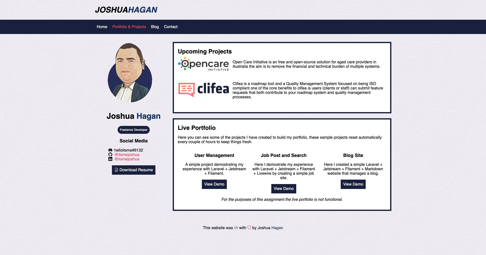
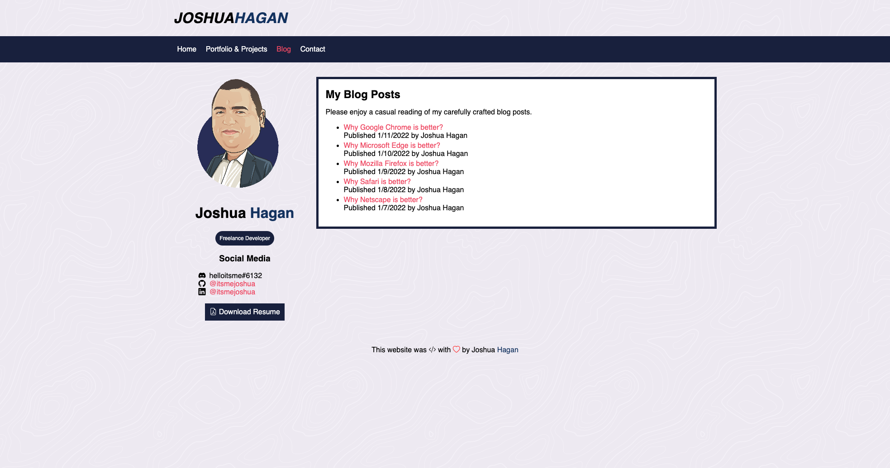
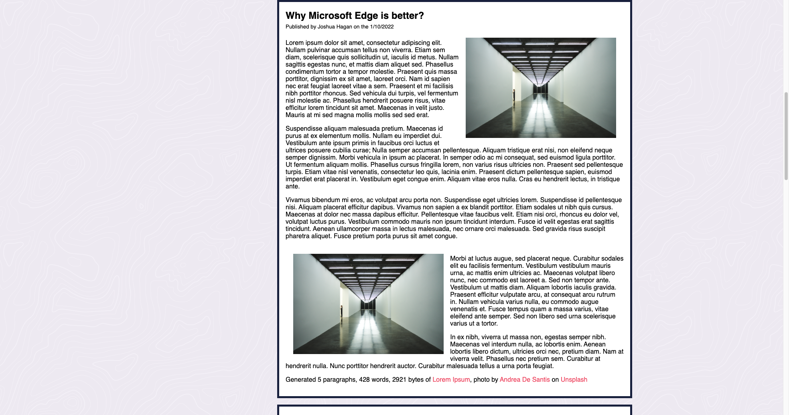
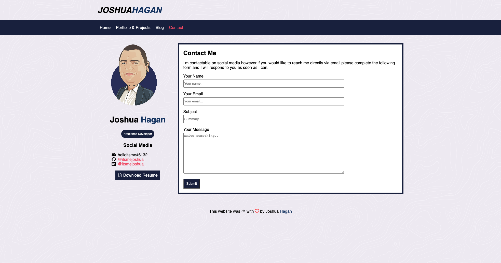

# Joshua Hagan Portfolio Website

## Links

* [Published Portfolio](https://tubular-stroopwafel-ad65c0.netlify.app/)
* [Github Repo](https://github.com/itsmejoshua/t1_a2)
* [Presentation Video](https://linkcomingsoon.com)

## Purpose
The purpose of this project is to create my personal website and portfolio for my coder academy Term 1 Assignment 2.

## Features

The website is navigated primary with a navigation bar in the header area of the website.

- Grid System
- Resuable elements
- Utility driven classes like mt-* mb-* col-\*-\*

## Sitemap
- [Home]()
- [Portfolio & Projects]()
- [Blog]()
    - [Why Google Chrome is better?]()
    - [Why Microsoft Edge is better?]()
    - [Why Mozilla Firefox is better?]()
    - [Why Safari is better?]()
    - [Why Netscape is better?]()
- [Contact]()

## Screenshots
Home Page

Portfolio & Projects Page

Blog & Article Page

Contact Page

## Target Audience
This website is intended for anyone wanting to see what I'm currently working on and contacting me for private hire.

## Tech Stack
* HTML
* CSS
* Github
* Netlify

